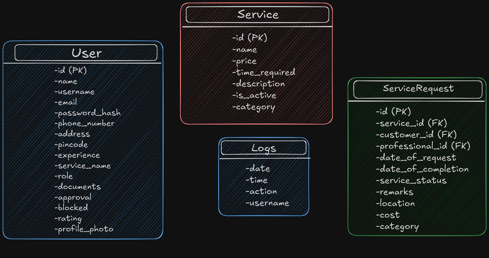

# Household Services Application

## Project Overview
The Household Services Application is designed to streamline the process of connecting customers with professionals for household services like plumbing, electrical work, cleaning, etc. The application serves three types of users: customers, service professionals, and administrators. The platform offers an easy way for users to book services, manage requests, and track status updates.

### High Level Design


### Table Schema
The schema consists of four tables: User, Services, ServiceRequest, and Logs.



## Objectives
- **Objective 1**: Provide an intuitive platform for customers to request household services.
- **Objective 2**: Enable service professionals to manage their service requests efficiently.
- **Objective 3**: Allow administrators to monitor service requests and manage users effectively.

## Architecture
The project follows a monolithic architecture to simplify development and maintenance in the early stages. This architecture makes use of a single application layer that handles both user interaction and business logic.

### Components
- **Frontend**: The user interface is built using HTML, CSS, Bootstrap, and JavaScript for responsive and interactive web pages.
- **Backend**: The backend is developed with Flask (Python), responsible for handling API requests, database operations, and user authentication.
- **Database**: SQLite is used for storing user information, service details, and request data.

## Technologies Used
- **Programming Languages**:
  - Python (for backend)
  - JavaScript (for frontend interactivity)
- **Frameworks**:
  - Flask (for backend and API management)
  - Bootstrap (for frontend styling)
- **Database**:
  - SQLite (for persistent storage)
- **Tools**:
  - Git (for version control)
  - SQLite DB Browser (for managing the local database)
  - Chart.js (for rendering charts and visual summaries)

## Installation
To set up the Household Services Application locally, follow these steps:

1. Clone the repository:
   ```bash
   git clone https://github.com/anshulbaliga7/iitm-mad1-project
   ```
2. Set up a virtual environment:
   ```bash
   python -m venv venv
   ```
3. Activate the virtual environment:
   - On Windows:
     ```bash
     venv\Scripts\activate
     ```
   - On macOS/Linux:
     ```bash
     source venv/bin/activate
     ```
4. Install dependencies:
   ```bash
   pip install -r requirements.txt
   ```
5. Create the SQLite database: You can use SQLite DB Browser or any SQLite tool to create the necessary tables using the provided models.
6. Run the Flask application:
   ```bash
   flask run
   ```
7. Access the application: Open your browser and go to `http://127.0.0.1:5000/`.

## Usage
### For Customers:
- Register for an account.
- Browse available services and request one.
- Track the status of requested services in your dashboard.
- Performs functions like: Closing requests, Editing requests, Searching for requests and Summary via graphs.

### For Service Professionals:
- Sign up to provide services.
- Manage service requests assigned to you.
- Update the status of services you have completed.
- Performs functions like: Approve/Reject Customer requests, Search customers/requests and Summary via graphs.

### For Administrators:
- Monitor service requests, users, and professionals.
- Manage approvals and block/unblock user accounts(Customers and Service Professionals).
- Performs functions like: Search services/requests/customers/professionals, and Summary via graphs.
